# Hands on Basics of Streaming ASR

Streaming speech recognition mechanics, implemented from scratch in PyTorch,
with **causality treated as a testable property** rather than a design claim.

The usual way to learn this material is to read a paper, then read a 40,000-line
toolkit that implements it behind nine layers of configuration. This repo is the
other thing: one small, readable implementation of each mechanism, and for every
one of them a test that would fail if the mechanism were wrong.

Most of the tests come in pairs:

- an **equality test** — run the component offline over the whole utterance, run
  it again frame-by-frame through the streaming path, assert the outputs match;
- a **leak test** — replace every frame after time *t*, read the output at time
  *t*, and assert it did not move. The naive implementation is kept alongside
  the correct one specifically so the leak test can catch it.

That second kind is the point. A non-causal streaming encoder trains fine,
validates fine on full utterances, and then degrades in production in a way
that looks like a data problem. The condition it violates is simple enough to
state:

```
 Y>t  ⊥  X>t  |  X≤t
```

Outputs up to time *t* must be conditionally independent of audio after *t*.
Every module here is an answer to "how do I keep that true while still using
self-attention, convolution and normalisation?"

## Try it

```bash
git clone https://github.com/basharawwad/streaming-asr-by-hand
cd streaming-asr-by-hand
pip install -r requirements.txt
pytest          # 92 tests
python demo.py  # narrated walkthrough
```

Only torch and pytest. No audio data, no training, no downloads.

### The notebook

[`notebooks/01_walkthrough.ipynb`](notebooks/01_walkthrough.ipynb) follows the
demo section by section and draws each mechanism: masks as matrices, the
transducer lattice with every alignment, the latency breakdown, the endpointer
on a timeline. Each section ends with **Try this** prompts that ask you to
change a parameter, or break a module on purpose, and predict the picture
before re-running. The figures in this README come from it.

```bash
pip install jupyterlab matplotlib
jupyter lab notebooks/01_walkthrough.ipynb
```

| # | Section | What it draws |
|---|---------|---------------|
| 1 | Causality | output change after a future perturbation; receptive field of centred vs causal conv; utterance vs running CMVN |
| 2 | Masks | full, causal and chunked masks; per-frame lookahead; delay vs chunk size |
| 3 | Conformer | streaming vs offline error per frame; KV cache length while streaming |
| 4 | Transducer | all alignments on the (t, u) lattice; how `delay_penalty` moves emission earlier |
| 5 | CTC | a peaky posteriorgram; both decode orders step by step |
| 6 | Latency | per-word emission delay; turn latency per endpointing preset; effect of RTFx |
| 7 | Endpointing | presets on a full utterance with a mid-sentence pause |
| 8 | Cache | encoder vs decoder-only memory; KV-head count |

## What the demo shows

**Causality is measurable, not assertable.**

```
  replaced every frame after t=10, then read the output at t=10
  centred conv (padding=K//2)  output moved by 1.157842  <- reads the future
  causal conv  (left padded)   output moved by 0.000000
```

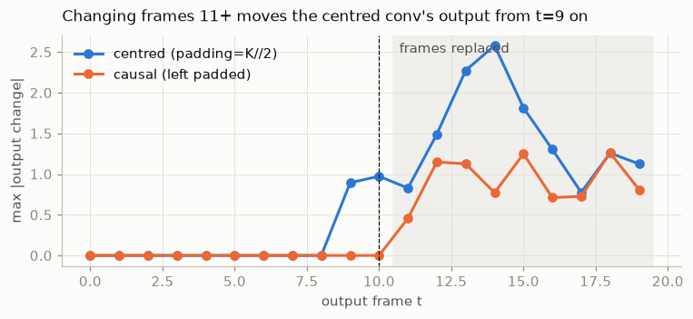

The centred conv's output moves at t=9 and t=10, before any input it should
depend on has changed. The receptive field shows why: each row is an output
frame, and the blue band is every input frame it reads. Anything right of the
diagonal is the future.

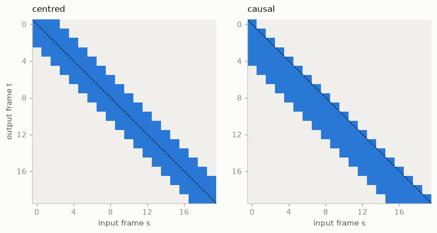

**The streaming path and the offline path are the same function.**

```
  input (1, 23, 32), chunk=4, left context=2 chunks
  max absolute difference: 4.77e-07
  same weights, same input, two completely different code paths
```

23 frames with chunk 4 is deliberate — a partial final chunk is where cache
eviction bugs live.

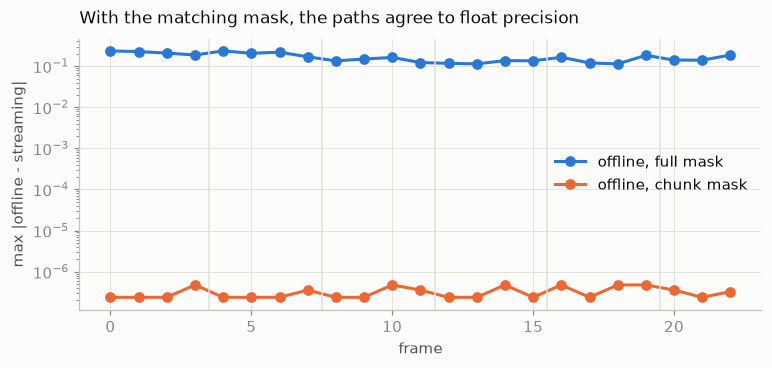

The control line is the same block run offline with a full mask. That is the
model a streaming system can never reproduce, and the gap is five orders of
magnitude.

**Four latencies, and they are four different numbers.**

```
  a turn-final response, broken down:
    algorithmic      520 ms  #####################
    emission         300 ms  ############
    compute           87 ms  ###
    endpointing     1280 ms  ###################################################
    network           40 ms  ##
    total           2227 ms
```

The number a paper reports is the first one. The number a user feels is the
total, and the largest term is usually the endpointer — a component that is
not in the model at all.

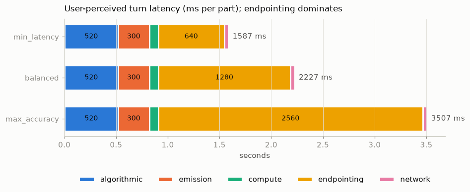

**The transducer loss is indifferent to when you emit.**

```
  T=4 frames, U=3 labels -> 20 monotonic paths
  forward recursion      9.874609
  brute-force over paths 9.874609
    delay_penalty=0.0 -> loss 5.8985
    delay_penalty=0.3 -> loss 6.5207
```

Marginalising over alignments weights a path only by its probability, so a late
emission scores exactly as well as an early one. Emission delay is therefore not
a bug to fix in the decoder — it is what the loss asked for, and a delay penalty
is how you ask for something else.

<p>
  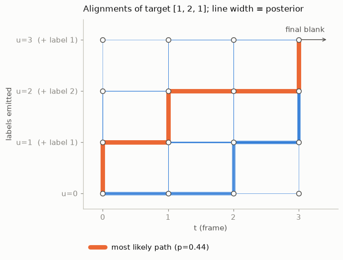
  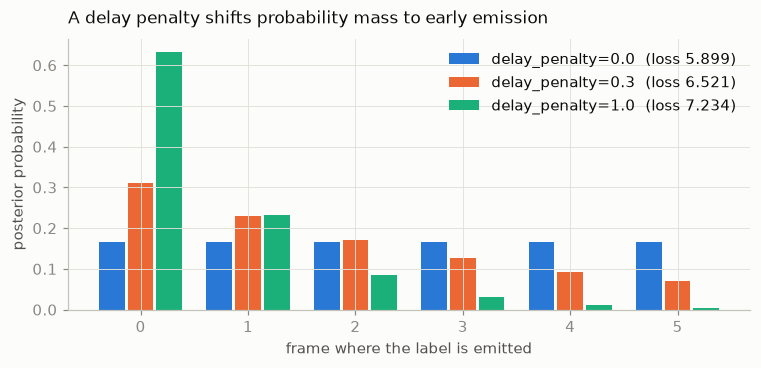
</p>

Left: every alignment of a 3-label target over 4 frames, drawn with width
proportional to its posterior. Right: with uniform joiner outputs every
emission frame is equally likely, until a delay penalty tilts the mass early.

## The modules

### `causality.py` — the three things that leak

Depthwise convolution with `padding=K//2` reads `K//2` frames into the future.
The fix is left-padding only. `CentredDepthwiseConv1d` is kept as the
counterexample; `CausalDepthwiseConv1d` adds `init_state`/`step` so the same
weights run frame-synchronously with a ring of past frames.

Normalisation is the subtler leak. BatchNorm's training-time statistics are
computed over the whole batch *including future frames*, so a BatchNorm
Conformer is non-causal during training even if inference looks fine — a
train/inference mismatch that shows up as a quality drop nobody can localise.
Hence LayerNorm throughout. `batchnorm_is_unsafe_note()` spells it out.

Feature normalisation has the same shape of problem: `utterance_cmvn` needs the
whole utterance; `RunningCMVN` uses only what has arrived. The test shows the
two disagree early and converge late, which is why streaming WER is worse on
the first second of audio.

### `masks.py` — the attention policy as one boolean matrix

`chunk_mask(num_frames, chunk_size, left_context_chunks, right_context_frames)`
generates full, causal and chunked attention from one function. Everything about
a streaming encoder's receptive field is in that matrix, and
`algorithmic_delay_frames` reads the latency straight off it: the first frame of
a chunk waits for the whole chunk, so the delay is `chunk_size - 1` frames, not
the average.

```
  chunk=4 frames, left context=1 chunk
  per-frame lookahead: [3, 2, 1, 0, 3, 2, 1, 0, 3, 2, 1, 0, 3, 2, 1, 0]
```

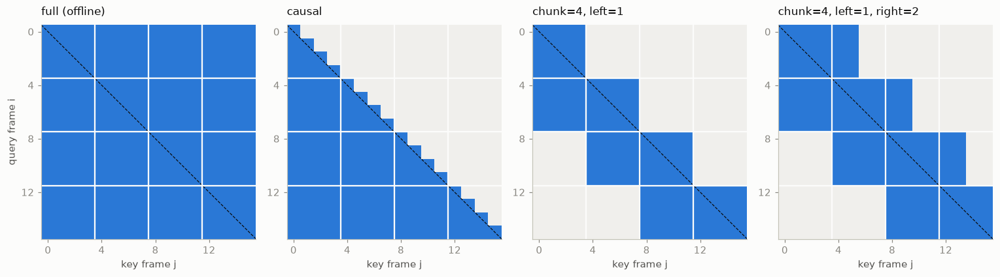

Blue right of the diagonal is lookahead and costs latency. Blue left of it is
history and costs memory.

### `cache.py` — bounded by construction

`LeftContextKVCache` with a `capacity`, and `keep_last(n)` for the eviction that
chunked attention actually needs. `kv_cache_bytes` computes
`2 × layers × kv_heads × head_dim × seq_len × dtype_bytes`, which is the whole
argument for GQA in one line:

```
  MHA 32 kv heads 2.15 GB   GQA 4 kv heads 0.27 GB   (8x)
```

And the asymmetry that matters for architecture choice:

```
   600s of audio   encoder    4.59 MB   decoder-only  491.52 MB
```

A chunked encoder's cache is bounded by its left context, whatever the audio
length. A decoder-only speech model's cache grows with the audio. That is not a
tuning difference, it is a different cost class.

<p>
  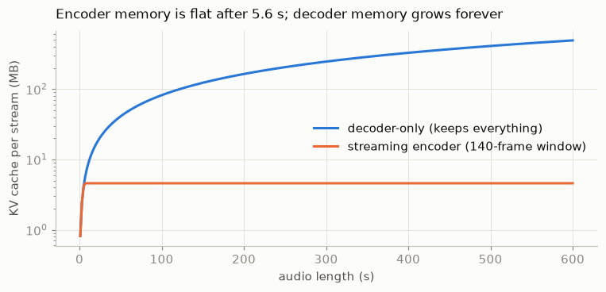
  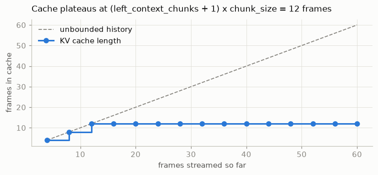
</p>

### `conformer.py` — a block that streams

FFN → MHSA → Conv → FFN with Macaron half-step residuals, relative position
bias, and a conv module in the canonical order (pointwise, GLU, depthwise
causal, LayerNorm, Swish, pointwise). Two entry points: `forward` with a mask
for training, `step` with caches for inference.

The one subtle line, in `step`:

```python
lo = max(0, (chunk_idx - self.left_context_chunks) * self.chunk_size)
keep = frames_after - lo
```

Eviction is derived from the **chunk index**, not from a fixed capacity.
Capacity-based eviction keeps the right number of frames for a full chunk and
the wrong number for a partial one, so offline and streaming agree on 24 frames
and silently diverge on 23. That is the bug the equality test is there to catch.

### `transducer.py` — the (t, u) lattice

`rnnt_loss` as the forward recursion over the lattice, and
`rnnt_loss_bruteforce` which enumerates every monotonic path explicitly. The two
agree to 1e-6 across shapes, which is the only way to be sure the recursion's
boundary conditions are right. `num_alignments(T, U)` counts the paths so you
can see why nobody does it the slow way.

Also `StatelessPredictor` (the prediction network reduced to an embedding of the
last *n* labels — nearly free, and barely worse, because the predictor was never
much of a language model), `Joiner`, and `TinyTransducer.greedy_decode`.

`delay_penalty` implements the FastEmit-style correction: tilt the lattice so
that emitting earlier is cheaper, and trade a little WER for a lot of emission
delay.

### `ctc.py` — and the decode-order bug

`ctc_greedy_decode` collapses repeats and *then* strips blanks.
`ctc_greedy_decode_buggy` does it the other way round. The difference is one
dropped letter in every word with a genuine double consonant — it passes a
smoke test on most utterances, which is exactly why it survives code review.

`ctc_loss_forward` is the 2U+1 extended-state recursion, checked against
`torch.nn.functional.ctc_loss`. `peaky_fraction` measures the blank dominance
that makes CTC posteriors precise about timing and useless for a confidence
threshold.

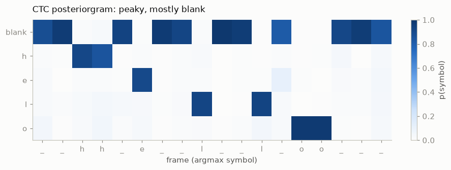

The blank between the two `l` frames is what keeps them apart. Collapse first
and you get `hello`. Strip blanks first and the two `l`s merge into `helo`.

**[`docs/ctc.md`](docs/ctc.md)** is the diagrammed version: why blank exists,
the trellis, why the skip transition is restricted, and why `T ≥ U + repeats`
means a mislabelled short clip can poison a batch.

### `latency.py` — the four numbers, kept apart

- **Algorithmic**: structural. Read off the mask.
- **Emission**: how long after the evidence the model commits. Measured from
  each word's *acoustic endpoint*, which is what makes it comparable across
  utterances. `awed` reports the median because the tail is the problem.
- **Compute**: `delay × (1 + 1/RTFx)` — the catch-up term, not just the
  inference time.
- **Endpointing**: usually the largest, and not in the model.

The finding worth carrying into an interview is in
`test_structural_delay_can_understate_what_the_user_waits`: a model configured
for 80 ms of structural delay, measured at a median word emission delay near
0.77 s. The reported latency and the experienced latency were an order of
magnitude apart, because the loss gave the model no reason to commit when the
evidence arrived.

### `endpointing.py` — an asymmetric loss with no gradient

A silence accumulator, a hard cutoff, and a semantic signal that is only
consulted *after* a minimum silence has elapsed — because a complete-sounding
clause mid-sentence is exactly when you must not interrupt.

```
  min_latency   sounds finished:   130 ms   sounds unfinished:   640 ms
  balanced      sounds finished:   130 ms   sounds unfinished:  1280 ms
  max_accuracy  sounds finished:   520 ms   sounds unfinished:  2560 ms
```

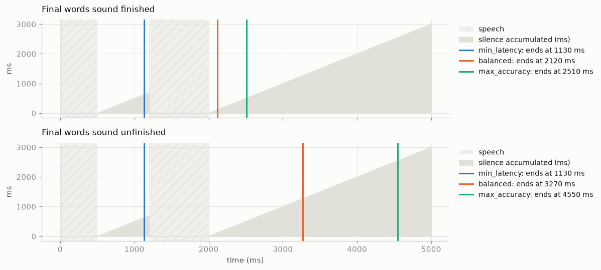

With a 700 ms pause mid-sentence, `min_latency` ends the turn while the speaker
is still talking, whatever the final words sound like. Once the last word is
spoken, the semantic signal decides whether `balanced` waits 128 ms or 1280 ms.

`test_raising_patience_mid_call_protects_a_spoken_phone_number` is the one to
read: during a digit string the punctuation model never sees a finished
sentence, so the semantic signal offers no protection and the hard cutoff does
all the work. The fix is per-stage patience, not a better endpointer.

### `continuous_adapter.py` — how a speech LLM consumes audio

`FrameStacker` (reshape `[T, D] → [T/k, k·D]`, no information lost),
`AudioProjector` with `calibrate_scale` so the projected embeddings land in the
same norm range as the text embedding table, and `splice_audio_embeddings`,
which overwrites placeholder rows in `inputs_embeds` and raises
`PlaceholderCountMismatch` rather than truncating — the off-by-one here is the
single most common bug in this family of models.

`build_labels` masks the audio and prompt positions to `-100`. The loss is over
**text tokens only**; the causal shift means the logits at the last audio
position are scored against the first transcript token, and that one shift is
the entire connection between the two modalities. No alignment is ever
represented.

The load-bearing test is
`test_the_audio_changes_the_text_loss_even_though_it_is_masked`. If perturbing
the audio leaves the text loss unchanged, the splice is not wired up and the
projector has no gradient. (The first version of `TinyLM` here had no attention,
which made that gradient exactly zero — a real bug, found by the test, fixed by
adding causal self-attention.)

`ToyVectorQuantiser` and `residual_quantise` sketch the discrete alternative,
and `tokens_per_second` makes the token-rate arithmetic that drives the whole
design space explicit.

**[`docs/how-transcriptions-are-used.md`](docs/how-transcriptions-are-used.md)**
is the diagrammed version, with the CTC / RNN-T / speech-LLM comparison table.

## What this is not

Not a toolkit, not competitive with one, and not trained on anything. There are
no pretrained weights, no audio loading, no beam search with an external LM, no
CUDA kernels. For real systems use k2/icefall, NeMo, ESPnet or WeNet — this repo
is for the layer underneath, where you want to know *why* the configuration flag
exists.

The implementations are chosen for legibility over speed. `rnnt_loss` loops in
Python where a real one is a fused kernel; the brute-force version is
deliberately exponential. Shapes are small on purpose.

## Further reading

- Conformer — [arXiv:2005.08100](https://arxiv.org/abs/2005.08100)
- Pruned RNN-T — [arXiv:2206.13236](https://arxiv.org/abs/2206.13236)
- Streaming speech LLMs — [arXiv:2509.08753](https://arxiv.org/abs/2509.08753)
- Delayed streams modelling — [arXiv:2609.18333](https://arxiv.org/abs/2609.18333)
- Full-duplex conversational speech — [arXiv:2602.24245](https://arxiv.org/abs/2602.24245)
- Emission latency in transducers — [arXiv:2604.14493](https://arxiv.org/abs/2604.14493)

## Licence

MIT. See [LICENSE](LICENSE).

Independent personal work. Not associated with, or derived from, any employer's
systems or code.
